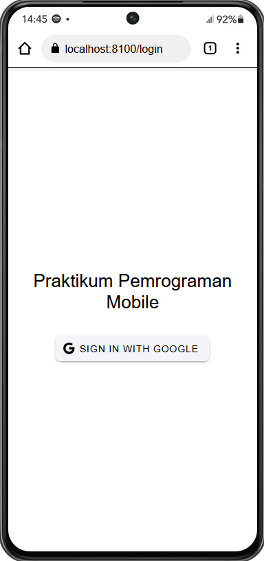
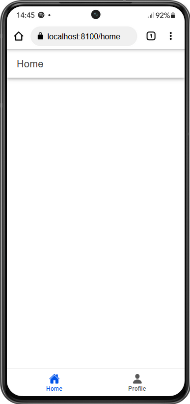

    Nama       : Zaki Jamali Arafi

    NIM        : H1D022048

    Shift Baru : D

# Tugas 9 - Pertemuan 10
## Ionic Vue Firebase

## Screenshot

### 1. Halaman Login


- Fungsi loginWithGoogle memulai proses autentikasi dengan menginisialisasi Google Auth menggunakan GoogleAuth.initialize. Ini memerlukan clientId dan scopes yang menentukan informasi apa saja yang akan diakses dari akun Google pengguna.

``` typescript
    await GoogleAuth.initialize({
        clientId: '190869532365-jo3u5nrnf3ddgvsvr9t9cckc67br4055.apps.googleusercontent.com',
        scopes: ['profile', 'email'],
        grantOfflineAccess: true,
    });
```

- Setelah inisialisasi, pengguna diminta untuk login dengan Google melalui GoogleAuth.signIn(). Ini akan membuka antarmuka login Google.

``` typescript
    const googleUser = await GoogleAuth.signIn();
```
- Setelah pengguna berhasil login, aplikasi mendapatkan idToken dari objek googleUser.

``` typescript
    const idToken = googleUser.authentication.idToken;
```

- ID token yang diperoleh digunakan untuk membuat kredensial Firebase dengan GoogleAuthProvider.credential(idToken).

``` typescript
    const credential = GoogleAuthProvider.credential(idToken);
```

- Kredensial yang dibuat digunakan untuk login ke Firebase dengan signInWithCredential(auth, credential). Ini akan mengautentikasi pengguna di Firebase dan mengembalikan objek pengguna.

``` typescript
    const result = await signInWithCredential(auth, credential);
```
- Informasi pengguna yang berhasil login disimpan dalam variabel user.

``` typescript
    user.value = result.user;
```

### 2. Halaman Home


- Halaman ini ditampilkan setelah pengguna berhasil melakukan login. Ini adalah halaman utama yang pengguna lihat setelah autentikasi.
- Menampilkan judul "Home" di bagian atas halaman.

### 3. Halaman Profile


- Menampilkan informasi profil pengguna dalam bentuk daftar (ion-list).

``` html
    <ion-list>
        <ion-item>
            <ion-input label="Nama" :value="user?.displayName" :readonly="true"></ion-input>
        </ion-item>
    </ion-list>
```

- Mengimpor dan menggunakan store autentikasi (useAuthStore) untuk mendapatkan informasi pengguna.
- Membuat referensi untuk menyimpan informasi pengguna (user) dan foto pengguna (userPhoto).
- Mendefinisikan fungsi logout yang memanggil metode logout dari authStore.
- Mendefinisikan fungsi handleImageError yang mengganti foto pengguna dengan gambar default jika terjadi kesalahan saat memuat gambar.

``` html
    <script setup lang="ts">
    import { IonContent, IonHeader, IonPage, IonTitle, IonToolbar, IonButton, IonIcon, IonLabel, IonAvatar, IonList, IonItem, IonInput } from '@ionic/vue';
    import { ref } from 'vue';
    import { exit } from 'ionicons/icons';
    import { useAuthStore } from '@/stores/auth';

    const authStore = useAuthStore();
    const user = ref(authStore.user);
    const userPhoto = ref(user.value?.photoURL || 'default-avatar.png');

    const logout = () => {
        authStore.logout();
    };

    const handleImageError = () => {
        userPhoto.value = 'default-avatar.png';
    };
    </script>
```