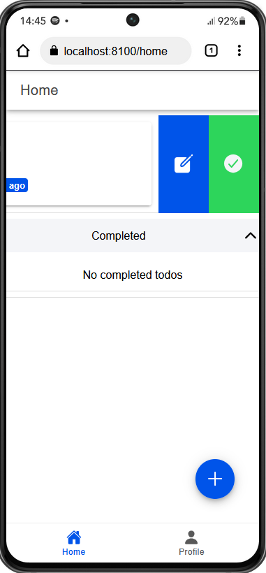

    Nama       : Zaki Jamali Arafi

    NIM        : H1D022048

    Shift Baru : D

# Tugas 10 - Pertemuan 11

## CRUD Todo

### 1. Create 

Fitur ini memungkinkan pengguna untuk menambahkan todo baru dengan mengisi input berupa judul dan deskripsi. Pengguna dapat menekan tombol "+" yang terletak di sudut kanan bawah untuk membuka jendela input. Setelah mengisi data yang diperlukan, pengguna dapat mengklik tombol "Add Todo" untuk menyimpan todo tersebut ke dalam Firestore.

### 2. Read

Daftar Todo ditampilkan dalam dua bagian: Active Todos dan Completed Todos. Setiap todo yang ditampilkan mencakup:
  - Title dari Todo
  - Deskripsi dari Todo 
  - Waktu pembuatan Todo 

### 3. Update

Tampilan ini muncul ketika ikon pensil diklik saat menggeser Todo yang sudah dibuat. Pengguna akan diarahkan ke halaman update yang berisi Title dan Description yang dapat diedit. Setelah melakukan perubahan, klik tombol "Edit Todo" untuk menyimpan pembaruan.

### 4. Delete

Pengguna dapat menghapus todo dengan menggeser Todo ke arah kanan, yang akan memunculkan ikon tempat sampah. Pengguna dapat menghapus todo yang dipilih dengan mengklik ikon tempat sampah tersebut. Setelah itu, notifikasi akan muncul untuk menandakan bahwa Todo telah berhasil dihapus.

### 5. Completed

Pengguna dapat memindahkan todo ke bagian "completed" dengan menggeser Todo ke arah kiri, yang akan memunculkan ikon centang. Pengguna dapat menandai todo yang dipilih dengan mengklik ikon centang tersebut. Setelah itu, todo yang dipilih akan berpindah ke bagian "completed".